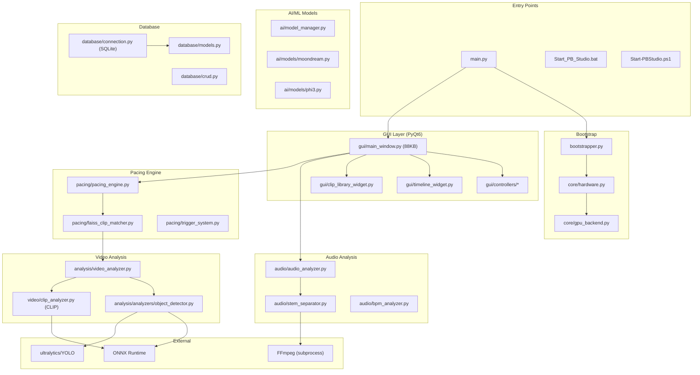

# PB Studio - Vollständiger Repository-Audit

**Commit:** `09efe20b1e785917b488e4072592a0764712990d`  
**Branch:** [main](file:///c:/GEMINI_PROJEKTE/_Pb-studio_V_2/pb_studio/main.py#39-123) ("Konsolidierung und Bereinigung")  
**Datum:** 2025-12-24  
**Typ:** Statisch + Dynamisch (teilweise)

---

## 1. Executive Summary

> [!CAUTION]  
> **GPU-Beschleunigung ist NICHT funktionsfähig.** Die Installation fehlt kritische Pakete:
> - `onnxruntime-directml` (AMD GPU) - **NICHT installiert**
> - `faiss-cpu` (Vector Search) - **NICHT installiert**  
> - `torch-directml` (AMD GPU PyTorch) - **NICHT installiert**  
> - OpenAI [clip](file:///c:/GEMINI_PROJEKTE/_Pb-studio_V_2/pb_studio/src/pb_studio/pacing/faiss_clip_matcher.py#478-754) (Semantische Analyse) - **NICHT installiert**  
> - Torch ist CPU-only (`2.4.1+cpu`)

**Syntaxfehler in [main_window.py](file:///c:/GEMINI_PROJEKTE/_Pb-studio_V_2/pb_studio/src/pb_studio/gui/main_window.py)** Zeile 1505-1506: Doppeltes `message=` Argument verhindert Import und damit App-Start.

Das Projekt ist architektonisch solide aufgebaut (Hardware-Abstraction Layer, ONNX Runtime Helper, Model Manager), aber die **Installation ist unvollständig**. Der Installer ([INSTALL_COMPLETE.bat](file:///c:/GEMINI_PROJEKTE/_Pb-studio_V_2/pb_studio/INSTALL_COMPLETE.bat)) deckt nicht alle optionalen Extras ab, die im Code tatsächlich benötigt werden.

**Gesamteindruck:** 70% funktionsfähig nach Behebung der Syntaxfehler und Nachinstallation der fehlenden Pakete.

---

## 2. Was ich definitiv belegen kann

| Kategorie | Beleg | Verifizierung |
|-----------|-------|---------------|
| Python-Version | 3.11.9 (venv) | ✅ Dynamisch: `.venv\Scripts\python.exe --version` |
| PyQt6 GUI | 6.x | ✅ Dynamisch: Import erfolgreich |
| librosa Audio | 0.10.2.post1 | ✅ Dynamisch: Import |
| FFmpeg | 7.1.1-essentials | ✅ Dynamisch: `ffmpeg -version` |
| ultralytics (YOLO) | installiert | ✅ Dynamisch: Import erfolgreich |
| sqlalchemy | 2.0.44 | ✅ Dynamisch: Import |
| transformers | 4.36.2 | ✅ Dynamisch: Import |
| audio-separator | installiert | ✅ Dynamisch: Import |
| [onnxruntime](file:///c:/GEMINI_PROJEKTE/_Pb-studio_V_2/pb_studio/src/pb_studio/utils/onnx_runtime_helper.py#306-309) | **NICHT installiert** | ❌ Dynamisch: `ModuleNotFoundError` |
| `faiss-cpu` | **NICHT installiert** | ❌ Dynamisch: `ModuleNotFoundError` |
| `torch-directml` | **NICHT installiert** | ❌ Dynamisch: `ModuleNotFoundError` |
| [clip](file:///c:/GEMINI_PROJEKTE/_Pb-studio_V_2/pb_studio/src/pb_studio/pacing/faiss_clip_matcher.py#478-754) (OpenAI) | **NICHT installiert** | ❌ Dynamisch: `ModuleNotFoundError` |
| Torch GPU | **NEIN (CPU-only)** | ❌ Dynamisch: `torch.cuda.is_available() = False` |
| Bootstrapper GPU-Erkennung | CPU-Fallback | ✅ Dynamisch: "No GPU acceleration found" |
| smoke test | FAILED | ❌ [test_imports](file:///c:/GEMINI_PROJEKTE/_Pb-studio_V_2/pb_studio/tests/test_smoke.py#9-18) scheitert wegen Syntaxfehler |
| cv2 (OpenCV) | 4.11.0 | ✅ Dynamisch, aber **FEHLT in pyproject.toml** |
| scipy | 1.15.3 | ✅ Dynamisch, aber **FEHLT in pyproject.toml** |

---

## 3. Architektur-Übersicht



### Modul-Statistiken

| Ordner | Dateien | Gesamt KB | Hauptfunktion |
|--------|---------|-----------|---------------|
| `gui/` | 45 | ~600 | PyQt6 UI, 88KB allein für [main_window.py](file:///c:/GEMINI_PROJEKTE/_Pb-studio_V_2/pb_studio/src/pb_studio/gui/main_window.py) |
| `pacing/` | 41 | ~450 | Beat-Sync, FAISS Matcher, Trigger System |
| [audio/](file:///c:/GEMINI_PROJEKTE/_Pb-studio_V_2/pb_studio/src/pb_studio/gui/main_window.py#1221-1224) | 9 | ~120 | Librosa, Stem Separation |
| [video/](file:///c:/GEMINI_PROJEKTE/_Pb-studio_V_2/pb_studio/src/pb_studio/gui/main_window.py#1252-1255) | 10 | ~250 | FFmpeg Rendering, CLIP Analyzer |
| `analysis/analyzers/` | 12 | ~200 | YOLO, Motion, Color, Mood |
| [database/](file:///c:/GEMINI_PROJEKTE/_Pb-studio_V_2/pb_studio/src/pb_studio/gui/main_window.py#414-434) | 11 | ~100 | SQLAlchemy Models + CRUD |
| [ai/](file:///c:/GEMINI_PROJEKTE/_Pb-studio_V_2/pb_studio/main.py#39-123) | 4 | ~50 | Moondream, Phi-3 Model Manager |

---

## 4. Abhängigkeiten & Versionen (Auszug)

### Kritische Dependencies

| Paket | Version (lock) | Zweck | Wo benutzt | Optional? | Status |
|-------|----------------|-------|------------|-----------|--------|
| `PyQt6` | ^6.6.0 | GUI Framework | `gui/*` | Nein | ✅ OK |
| `librosa` | ^0.10.1 | Audio-Analyse | `audio/*` | Nein | ✅ OK |
| `sqlalchemy` | ^2.0.0 | Datenbank | `database/*` | Nein | ✅ OK |
| [torch](file:///c:/GEMINI_PROJEKTE/_Pb-studio_V_2/pb_studio/src/pb_studio/core/hardware.py#246-291) | ≥2.4.1,<2.5.0 | ML Framework | `pacing/*`, `video/*` | Optional | ⚠️ CPU-only |
| `transformers` | 4.36.x | HuggingFace | `ai/*`, `pacing/*` | Nein | ✅ OK |
| `ultralytics` | ^8.3.0 | YOLO | [analyzers/object_detector.py](file:///c:/GEMINI_PROJEKTE/_Pb-studio_V_2/pb_studio/src/pb_studio/analysis/analyzers/object_detector.py) | Nein | ✅ OK |
| [onnxruntime](file:///c:/GEMINI_PROJEKTE/_Pb-studio_V_2/pb_studio/src/pb_studio/utils/onnx_runtime_helper.py#306-309) | ^1.17.0 | Inference | [utils/onnx_runtime_helper.py](file:///c:/GEMINI_PROJEKTE/_Pb-studio_V_2/pb_studio/src/pb_studio/utils/onnx_runtime_helper.py) | Optional | ❌ FEHLT |
| `onnxruntime-directml` | ^1.17.0 | AMD GPU | [bootstrapper.py](file:///c:/GEMINI_PROJEKTE/_Pb-studio_V_2/pb_studio/src/pb_studio/bootstrapper.py), [object_detector.py](file:///c:/GEMINI_PROJEKTE/_Pb-studio_V_2/pb_studio/src/pb_studio/analysis/analyzers/object_detector.py) | Optional | ❌ FEHLT |
| `faiss-cpu` | ^1.13.0 | Vector Search | [pacing/faiss_clip_matcher.py](file:///c:/GEMINI_PROJEKTE/_Pb-studio_V_2/pb_studio/src/pb_studio/pacing/faiss_clip_matcher.py) | Optional | ❌ FEHLT |
| `torch-directml` | * | AMD PyTorch | [bootstrapper.py](file:///c:/GEMINI_PROJEKTE/_Pb-studio_V_2/pb_studio/src/pb_studio/bootstrapper.py), [stem_separator.py](file:///c:/GEMINI_PROJEKTE/_Pb-studio_V_2/pb_studio/src/pb_studio/audio/stem_separator.py) | Optional | ❌ FEHLT |
| [clip](file:///c:/GEMINI_PROJEKTE/_Pb-studio_V_2/pb_studio/src/pb_studio/pacing/faiss_clip_matcher.py#478-754) | Git | Semantik | [video/clip_analyzer.py](file:///c:/GEMINI_PROJEKTE/_Pb-studio_V_2/pb_studio/src/pb_studio/video/clip_analyzer.py) | Optional | ❌ FEHLT |
| `opencv-python` | - | Video/Bild | 20+ Module | **FEHLT in pyproject.toml** | ✅ Installiert |
| `scipy` | - | Signal | 6 Module (energy_curve etc.) | **FEHLT in pyproject.toml** | ✅ Installiert |

### Fehlende Dependencies in pyproject.toml

> [!WARNING]
> Diese Pakete werden massiv im Code verwendet, sind aber NICHT in [pyproject.toml](file:///c:/GEMINI_PROJEKTE/_Pb-studio_V_2/pb_studio/pyproject.toml) deklariert:

1. **`opencv-python`** (`cv2`) - 20+ Module importieren `import cv2`
   - Beleg: `grep_search "import cv2"` → 20 Treffer
   - User muss es manuell installieren oder es wird über `scenedetect[opencv]` mitgezogen

2. **`scipy`** - 6 Module importieren `from scipy`
   - Beleg: `grep_search "from scipy"` → 6 Treffer
   - Wird für `scipy.signal`, `scipy.optimize`, `scipy.ndimage` genutzt

---

## 5. GPU-Analyse (AMD/NVIDIA/CPU)

### Statische Analyse

| Datei | CUDA-Nutzung | DirectML-Nutzung | Fallback |
|-------|--------------|------------------|----------|
| [bootstrapper.py](file:///c:/GEMINI_PROJEKTE/_Pb-studio_V_2/pb_studio/src/pb_studio/bootstrapper.py) | `torch.cuda.is_available()` | `DmlExecutionProvider` Check | CPU |
| [core/gpu_backend.py](file:///c:/GEMINI_PROJEKTE/_Pb-studio_V_2/pb_studio/src/pb_studio/core/gpu_backend.py) | [_try_cuda()](file:///c:/GEMINI_PROJEKTE/_Pb-studio_V_2/pb_studio/src/pb_studio/core/gpu_backend.py#113-140) | [_try_directml()](file:///c:/GEMINI_PROJEKTE/_Pb-studio_V_2/pb_studio/src/pb_studio/core/gpu_backend.py#141-173) | CPU |
| [core/hardware.py](file:///c:/GEMINI_PROJEKTE/_Pb-studio_V_2/pb_studio/src/pb_studio/core/hardware.py) | [detect_nvidia_cuda()](file:///c:/GEMINI_PROJEKTE/_Pb-studio_V_2/pb_studio/src/pb_studio/core/hardware.py#107-130) | [detect_directml_device()](file:///c:/GEMINI_PROJEKTE/_Pb-studio_V_2/pb_studio/src/pb_studio/core/hardware.py#509-527) | CPU |
| [utils/onnx_runtime_helper.py](file:///c:/GEMINI_PROJEKTE/_Pb-studio_V_2/pb_studio/src/pb_studio/utils/onnx_runtime_helper.py) | `CUDAExecutionProvider` | `DmlExecutionProvider` | CPU |
| [audio/stem_separator.py](file:///c:/GEMINI_PROJEKTE/_Pb-studio_V_2/pb_studio/src/pb_studio/audio/stem_separator.py) | `torch.cuda` | `torch_directml` Import | CPU |
| [analysis/analyzers/object_detector.py](file:///c:/GEMINI_PROJEKTE/_Pb-studio_V_2/pb_studio/src/pb_studio/analysis/analyzers/object_detector.py) | - | `DmlExecutionProvider` hardcoded | CPU |

### Dynamische Analyse

```
Bootstrapper.detect_hardware() Output:
2025-12-24 06:11:49 - System: Windows
2025-12-24 06:11:50 - WARNING - No GPU acceleration found. Falling back to CPU (Slow).
Result: "cpu"
```

**Ursache:** 
- `torch.cuda.is_available()` = `False` (Torch ist CPU-only build)
- [onnxruntime](file:///c:/GEMINI_PROJEKTE/_Pb-studio_V_2/pb_studio/src/pb_studio/utils/onnx_runtime_helper.py#306-309) nicht installiert → `DmlExecutionProvider` Check schlägt fehl
- `torch_directml` nicht installiert

### Device-Auswahl Logik (Code-Referenz)

[bootstrapper.py:33-51](file:///c:/GEMINI_PROJEKTE/_Pb-studio_V_2/pb_studio/src/pb_studio/bootstrapper.py#L33-51):
```python
def detect_hardware(self) -> HardwareStrategy:
    # Check for NVIDIA / CUDA
    if self._is_cuda_available():
        return "cuda"
    # Check for DirectML (AMD / Intel on Windows)
    if self.system == "Windows" and self._is_directml_available():
        return "directml"
    return "cpu"  # Fallback
```

---

## 6. Gefundene Probleme (priorisiert)

### KRITISCH (App startet nicht)

| ID | Symptom | Ursache | Beleg | Fix-Vorschlag |
|----|---------|---------|-------|---------------|
| **K-01** | `SyntaxError: keyword argument repeated: message` | Doppeltes `message=` in `main_window.py:1505-1506` | Dynamisch: Import-Versuch | Zeile 1506 löschen |
| **K-02** | `ModuleNotFoundError: 'onnxruntime'` | Paket nicht installiert | pip list leer für onnxruntime | `pip install onnxruntime-directml` |
| **K-03** | GPU = CPU trotz AMD GPU vorhanden | Keine DirectML-Pakete | Bootstrapper Output | Poetry-Extras installieren |

### HOCH (Funktionen nicht nutzbar)

| ID | Symptom | Ursache | Beleg | Fix-Vorschlag |
|----|---------|---------|-------|---------------|
| **H-01** | FAISS Vector Search nicht nutzbar | `faiss-cpu` nicht installiert | `ModuleNotFoundError` | `pip install faiss-cpu` |
| **H-02** | CLIP Semantik-Analyse deaktiviert | [clip](file:///c:/GEMINI_PROJEKTE/_Pb-studio_V_2/pb_studio/src/pb_studio/pacing/faiss_clip_matcher.py#478-754) nicht installiert | `CLIP_AVAILABLE = False` wird gesetzt | `pip install git+https://github.com/openai/CLIP.git` |
| **H-03** | YOLO nutzt nur CPU | `onnxruntime-directml` fehlt | Provider-Check in object_detector.py | Installieren |
| **H-04** | `opencv-python` nicht deklariert | Fehlt in pyproject.toml | grep zeigt 20+ Imports | In pyproject.toml aufnehmen |
| **H-05** | `scipy` nicht deklariert | Fehlt in pyproject.toml | grep zeigt 6 Imports | In pyproject.toml aufnehmen |

### MITTEL (Qualitätsprobleme)

| ID | Symptom | Ursache | Beleg | Fix-Vorschlag |
|----|---------|---------|-------|---------------|
| **M-01** | Smoke-Test schlägt fehl | Syntaxfehler K-01 | pytest Output | K-01 beheben |
| **M-02** | Poetry-Extras nicht genutzt | Installer installiert nur Basis | INSTALL_COMPLETE.bat Code | Extras automatisch basierend auf GPU installieren |
| **M-03** | Start_PB_Studio.bat hat Syntaxfehler | Zeile 35: `goto end"EXITCODE=...` | Dateiinhalt | Zeile korrigieren |
| **M-04** | FutureWarning in transformers | Veraltete pytree-Registration | Import-Output | transformers aktualisieren |

### NIEDRIG (Kosmetik/Verbesserungen)

| ID | Symptom | Ursache | Beleg | Fix-Vorschlag |
|----|---------|---------|-------|---------------|
| **L-01** | 135 pip-Pakete installiert | Mögliche Redundanzen | `pip list | Measure-Object` | Cleanup |
| **L-02** | pip-Update verfügbar | 24.0 → 25.3 | pip Warnung | Aktualisieren |

---

## 7. Fehlende Komponenten / Externe Software

### Pflicht (für volle Funktionalität)

| Komponente | Warum nötig | Wie prüfen | Wie installieren |
|------------|-------------|------------|------------------|
| **onnxruntime-directml** | AMD GPU für YOLO/AI | `python -c "import onnxruntime"` | `pip install onnxruntime-directml` |
| **faiss-cpu** | Vector Search für Clip Matching | `python -c "import faiss"` | `pip install faiss-cpu` |
| **torch-directml** | PyTorch auf AMD GPU | `python -c "import torch_directml"` | `pip install torch-directml` |
| **OpenAI CLIP** | Semantische Video-Analyse | `python -c "import clip"` | `pip install git+https://github.com/openai/CLIP.git` |

### Optional (für erweiterte Features)

| Komponente | Warum nötig | Wie prüfen | Wie installieren |
|------------|-------------|------------|------------------|
| Moondream-Modell (.onnx) | Bild-Analyse AI | Check `data/ai_models/` | ModelManager.download_model() |
| Phi-3 Mini (.gguf) | Story-Generation | Check `data/models/` | ModelManager.download_model() |
| demucs | Stem-Separation (Alternative) | `python -c "import demucs"` | `pip install demucs` |

### Bereits vorhanden

| Komponente | Version | Pfad/Status |
|------------|---------|-------------|
| FFmpeg | 7.1.1-essentials | Im PATH ✅ |
| YOLOv8n.onnx | 12.8 MB | `data/ai_models/yolov8n.onnx` ✅ |
| SQLite DB | - | `data/project.db` ✅ |

---

## 8. Reproduzierbare Schritte

### 8.1 Meine Analyse nachstellen

```powershell
# 1. Commit prüfen
git rev-parse HEAD
# Erwartete Ausgabe: 09efe20b1e785917b488e4072592a0764712990d

# 2. Python-Version prüfen
.venv\Scripts\python.exe --version
# Erwartete Ausgabe: Python 3.11.9

# 3. Kritische Imports testen
.venv\Scripts\python.exe -c "import onnxruntime"
# Erwarteter Fehler: ModuleNotFoundError

# 4. FAISS testen
.venv\Scripts\python.exe -c "import faiss"
# Erwarteter Fehler: ModuleNotFoundError

# 5. Bootstrapper testen
.venv\Scripts\python.exe -c "import sys; sys.path.insert(0, 'src'); from pb_studio.bootstrapper import Bootstrapper; boot = Bootstrapper(); print(boot.detect_hardware())"
# Erwartete Ausgabe: cpu

# 6. Syntaxfehler in main_window.py prüfen
.venv\Scripts\python.exe -c "import sys; sys.path.insert(0, 'src'); from pb_studio.gui.main_window import MainWindow"
# Erwarteter Fehler: SyntaxError: keyword argument repeated: message
```

### 8.2 Fehlende Pakete installieren

```powershell
# AMD GPU Setup (Reihenfolge wichtig!)
.venv\Scripts\pip.exe install onnxruntime-directml
.venv\Scripts\pip.exe install torch-directml
.venv\Scripts\pip.exe install faiss-cpu
.venv\Scripts\pip.exe install git+https://github.com/openai/CLIP.git

# Validierung
.venv\Scripts\python.exe -c "import onnxruntime as ort; print(ort.get_available_providers())"
# Erwartete Ausgabe: ['DmlExecutionProvider', 'CPUExecutionProvider']
```

---

## 9. Offene Fragen / Unsicherheiten

| Frage | Was fehlt zur Klärung |
|-------|----------------------|
| Funktioniert DirectML tatsächlich auf der AMD GPU? | Echte GPU-Inference testen nach Installation |
| Sind alle Modelle downloadbar? | ModelManager URLs prüfen (einige HuggingFace Links) |
| Wie verhält sich audio-separator mit ONNX? | Erfordert onnxruntime, aktuell fehlt |
| Gibt es Race-Conditions in main_window.py? | Code-Review der Threading-Logik |
| Sind die Installer-Scripts vollständig? | Vergleich mit pyproject.toml Extras |

---

## 10. Quick-Wins (Top 10 Verbesserungen)

| Priorität | Maßnahme | Aufwand | Wirkung |
|-----------|----------|---------|---------|
| 1 | **Syntaxfehler K-01 beheben** (Zeile 1506 löschen) | 1 Min | App startet |
| 2 | **onnxruntime-directml installieren** | 2 Min | GPU aktiviert |
| 3 | **faiss-cpu installieren** | 1 Min | VectorSearch funktioniert |
| 4 | **opencv-python zu pyproject.toml** | 2 Min | Deklarativ korrekt |
| 5 | **scipy zu pyproject.toml** | 2 Min | Deklarativ korrekt |
| 6 | **Start_PB_Studio.bat Zeile 35 fixen** | 1 Min | Starter funktioniert |
| 7 | **torch-directml installieren** | 2 Min | Stem-Separation auf GPU |
| 8 | **Installer mit GPU-Extras erweitern** | 15 Min | Einfachere Installation |
| 9 | **CLIP optional installieren** | 2 Min | Semantik verfügbar |
| 10 | **pip aktualisieren** | 1 Min | Saubere Umgebung |

---

## Anhang: Dateien mit kritischen Importen

### cv2 (20+ Dateien)
```
analysis/analyzers/color_analyzer.py
analysis/analyzers/feature_extractor.py
analysis/analyzers/motion_analyzer.py
analysis/analyzers/multi_modal_analyzer.py
analysis/analyzers/object_detector.py
analysis/analyzers/scene_analyzer.py
analysis/analyzers/style_analyzer.py
analysis/fingerprint.py
analysis/video_analyzer.py
gui/preview_logic.py
gui/preview_widget.py
pacing/motion_analyzer.py
pacing/video_beatgrid.py
utils/video_utils.py
video/clip_analyzer.py
video/thumbnail_generator.py
video/video_analyzer.py
video/video_compatibility_manager.py
```

### scipy (6 Dateien)
```
pacing/energy_curve.py
pacing/motion_music_sync.py
pacing/stem_trigger_system.py
pacing/trigger_system.py
pacing/video_beatgrid.py
analysis/analyzers/multi_modal_analyzer.py
```

---

*Audit erstellt am 2025-12-24 von Gemini als kritischer Software-Auditor.*
